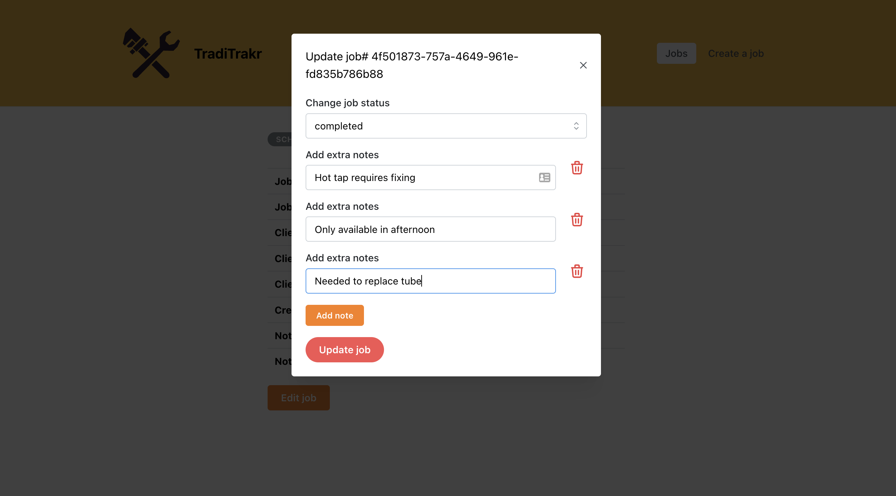

# TradiTrakr - The essential app for tradies

This app allows tradies to create, view and update their jobs.

Jobs have the following information associated with them:

- Unique job identifier.
- Status: one of "scheduled", "active", "invoicing", “priced” or “completed”.
- Creation date and time.
- Name and contact details of the client.
- The tradie can also make notes for each job. A job can have any number of notes associated with them.

The TradiTrakr app allows tradies to:

- Filter by jobs by status.
- Sort the jobs by date.
- Click on a job in the list to view the details and add/edit notes for that job.
- Change the status of a job.
- Delete a job.

Jobs are saved in localstorage using Recoil Persist.

## Screenshot of TradiTrakr Job List

## Screenshot of TradiTrakr Job Form

## Screenshot of TradiTrakr Specific Job View

## Screenshot of TradiTrakr Update Job View

## Dependencies

This project uses the following systems:

- [React](https://github.com/facebook/react)
- [React Router](https://reactrouter.com/docs/en/v6)
- [Recoil](https://recoiljs.org/)
- [Recoil Persist](https://github.com/polemius/recoil-persist)
- [Mantine](https://mantine.dev/) - running previous version 4.2.12 to utilise formList
- [date-fns](https://date-fns.org/)
- [tabler-icons-react](https://tabler-icons-react.vercel.app/)
- [UUID](https://github.com/uuidjs/uuid)

## Dev dependencies

- [Prettier](https://prettier.io/)
- [Testing Library](https://testing-library.com/)

## Local development

1. Run `npm install`
2. Run `npm start` to start the react app
3. Run `npm test` to run tests

## Deployed site

[TradiTrakr](https://traditrakr.netlify.app/)

## Citations

- Logo created on: [Canva](https://www.canva.com/)
